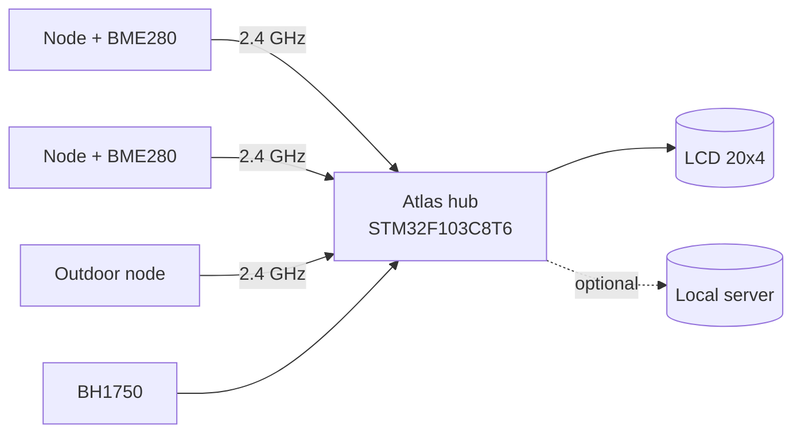

# Atlas

The hub and user interface for the Psychrometer sensor family: it concentrates
periodic readings from miniature low-power nodes over a 2.4 GHz nRF24L01+ star
network, displays them on an LCD, and may forward them to a local server.

**Version:** 0.1.0 | **Status:** concept

---

## Overview

Atlas is the mains-powered counterpart to the Psychrometer nodes. It listens on
the nRF24L01+ star network, keeps the latest temperature / humidity / pressure
reading from every node, and presents them on a 20x4 character LCD. Ambient
light from a BH1750 drives automatic backlight and contrast so the panel is
readable in the dark and in daylight. An optional uplink concentrates the data
toward a local server.

---

## Hardware

| Role | Part | Notes |
|---|---|---|
| Hub MCU | STM32F103C8T6 | 64 KB Flash, 20 KB RAM, bare registers |
| Radio | nRF24L01+ | 2.4 GHz, SPI1, PRX role, 3.3 V |
| Display | BC2004BGPLCH6 | 20x4 char, HD44780, 4-bit, 5 V |
| Light sensor | BH1750 | I2C, ambient lux for auto bright/contrast |
| Contrast | PWM + RC on V0 | timer-driven, auto from BH1750 |
| Backlight | PWM via switch | timer-driven, auto from BH1750 |
| Uplink | ENC28J60 (SPI) | dev board, to local server |
| Power | mains / 5 V | not power-constrained |

---

## Scheduler

Task flow is driven by **AcroSched 1.7** (static cooperative dispatcher),
shipped as a prebuilt library (`.a`) plus public headers; sources stay private.
Library parameters are compile-time and frozen at build:

| Parameter | Value | Purpose |
|---|---|---|
| `ACROSCHED_MAX_TASKS` | 12 | ~6 tasks + headroom |
| `ACROSCHED_USE_WATCHDOG` | 1 | IWDG refresh hook |
| `ACROSCHED_USE_TIMERS` | 1 (`MAX_TIMERS` 4) | stale timeout, carousel |
| `ACROSCHED_USE_IPC` | 1 | mailbox/event flags (nRF IRQ -> task) |
| `ACROSCHED_USE_IDLE_HOOK` | 1 | `__WFI()` until next interrupt |
| introspection / stats / hooks | 0 | debug only |

---

## Network

- Topology: **star** - up to **20** nodes report to Atlas (PRX).
- nRF24L01+ has 6 hardware pipes; node id in payload distinguishes nodes.
- Auto-ACK with retransmit; each reading carries id, T, H, P, battery/status.
- Stale flag if a node misses N transmit periods.

---

## Repository layout

| Path | Purpose |
|---|---|
| `inc/` | Public headers |
| `src/` | Application sources (radio, render, sensors) |
| `port/` | STM32F103 register-level platform code |
| `third_party/acrosched/` | AcroSched lib (`.a`) + headers, frozen config |
| `docs/` | Doxygen config and diagrams |
| `requirements.md` | Requirements and task backlog |
| `HISTORY.md` | Milestone log |
| `CHANGELOG.md` | Versioned change log |

---

## Toolchain

CMSIS-Toolbox, bare-register access (no HAL, no CubeMX).

---

## License

See [LICENSE](LICENSE).
